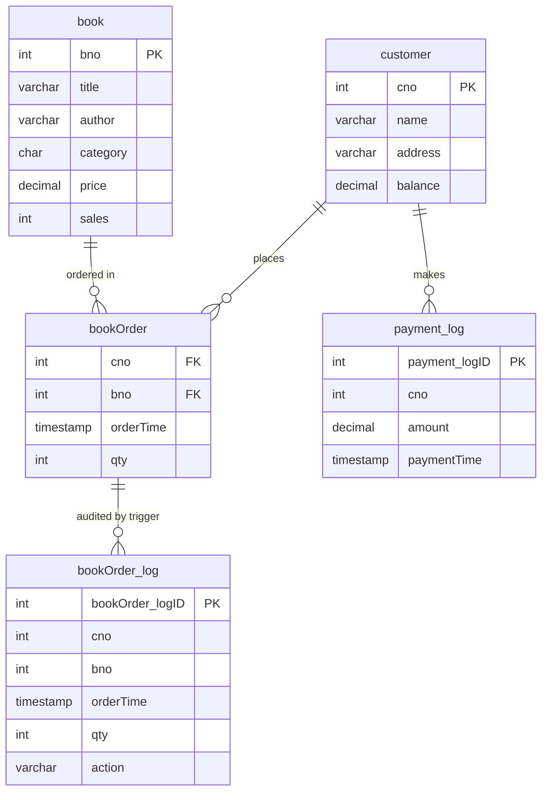

# Bookstore Order Management (PostgreSQL)

A small relational database for a bookstore's catalogue, customers, and
orders, with the core business rules — updating sales counts, updating
customer balances, and audit-logging every order change — implemented as
database triggers rather than application code. Includes a Python client
that drives the database through parameterised queries.

This started as coursework for a relational databases module and has
been reworked here as a standalone project: credentials and
university-specific material removed, queries rewritten to be
injection-safe, and the whole thing restructured for someone else to
clone and run.

A full write-up of the design, trigger semantics, security decisions,
and end-to-end test results is in [`report/Bookstore.pdf`](report/Bookstore.pdf)
(source: `report/Bookstore.tex`).

## Schema



`bookOrder_log` and `payment_log` are append-only audit tables populated
entirely by triggers — nothing writes to them directly except the
triggers themselves and `payment_function`.

## What the triggers do

| Trigger | Fires on | Effect |
|---|---|---|
| `log_bookOrders_trigger` | any change to `bookOrder` | writes a row to `bookOrder_log` tagged `INSERT`/`UPDATE`/`DELETE` |
| `sales_trigger` | insert into `bookOrder` | adds the order quantity onto `book.sales` |
| `balance_trigger` | insert into `bookOrder` | adds `qty * price` onto the customer's `balance` |
| `payment_trigger` | insert into `payment_log` | subtracts the payment amount from the customer's `balance` |

`payment_function(cno, amount)` is the only way to log a payment — it
checks the customer exists before inserting into `payment_log`, which is
what fires `payment_trigger`.

Four views (`current_orders`, `book_report`, `customer_report`,
`customer_bookorders`) cover the reporting queries: orders matching a
title fragment, sales/value by category, books-ordered per customer, and
order history for a given customer.

## Setup

Requires PostgreSQL and Python 3.10+.

1. Create a database and run the SQL files in order:

   ```bash
   createdb bookstore
   psql -d bookstore -f sql/01_schema.sql
   psql -d bookstore -f sql/02_functions_and_triggers.sql
   psql -d bookstore -f sql/03_views.sql
   psql -d bookstore -f sql/04_sample_data.sql   # optional seed data
   ```

2. Install the Python client's dependencies:

   ```bash
   cd python_client
   pip install -r requirements.txt
   ```

3. Copy `.env.example` to `.env` (in the repo root) and fill in your own
   database credentials. `.env` is gitignored and is never committed.

## Usage

Run a batch of transactions from a script file:

```bash
cd python_client
python run_transactions.py sample_transactions.txt output.txt
```

`sample_transactions.txt` demonstrates every command type (insert/delete
a book, insert/delete a customer, place an order, log a payment, search
by title fragment, view a customer's order history, and both summary
reports) — see the docstring at the top of `run_transactions.py` for the
full command reference.

Or use the client directly:

```python
from db_client import BookstoreClient

with BookstoreClient() as db:
    db.insert_book(234567, "Python Crash Course", "Matthes E.", "Science", 24.22)
    db.place_order(cno=900001, bno=234567, qty=2)
    print(db.book_sales_report())
```

`BookstoreClient` owns a single connection and exposes one method per
business transaction. `TransactionRunner` (in `run_transactions.py`)
wraps a `BookstoreClient` to drive a batch of commands from a script
file, dispatching each command code to its own handler method.

## Known limitations

`sales_trigger`, `balance_trigger`, and `payment_trigger` are all
**statement-level** triggers (`AFTER INSERT`, no `FOR EACH ROW`) that
look up the single most recent row in `bookOrder_log` / `payment_log`
to decide what to add to or subtract from `book.sales` /
`customer.balance`, rather than referencing `NEW` directly (statement-
level triggers don't have row bindings). That matches how the
application writes to these tables — `BookstoreClient.place_order` and
`make_payment` each issue one `INSERT` per call — but it means a
multi-row `INSERT ... VALUES (...), (...), (...)` only updates the
aggregates for the **last** row in that statement; the seed data in
`04_sample_data.sql` inserts one row per statement for exactly this
reason. Bulk-loading orders or payments (e.g. from a CSV) would need
the trigger functions reworked to reference `NEW` directly under
`FOR EACH ROW` triggers instead of querying `MAX(...logid)`.

## Notes on the rework

The original coursework version built every SQL statement with Python
string formatting (`"INSERT ... VALUES ({})".format(data)`), which is a
textbook SQL-injection vector, and stored a live database password in a
plaintext file committed alongside the code. This version:

- uses parameterised queries (`cur.execute(sql, params)`) throughout —
  no query string is ever built by interpolating input directly;
- reads connection details from environment variables via `.env`
  (gitignored), never hardcoded;
- widens `book.title`/`book.author` and `customer.name`/`customer.address`
  from the original `VARCHAR(20)`/`VARCHAR(30)` — tight enough that
  ordinary book titles and addresses were getting rejected outright;
- wraps the connection and every transaction in a `BookstoreClient`
  class instead of loose functions passing a connection object around,
  with the connection lifecycle handled through the context manager
  protocol (`with BookstoreClient() as db:`);
- drops the university-specific assessment material and identifiers
  that had no place in a public repo.
